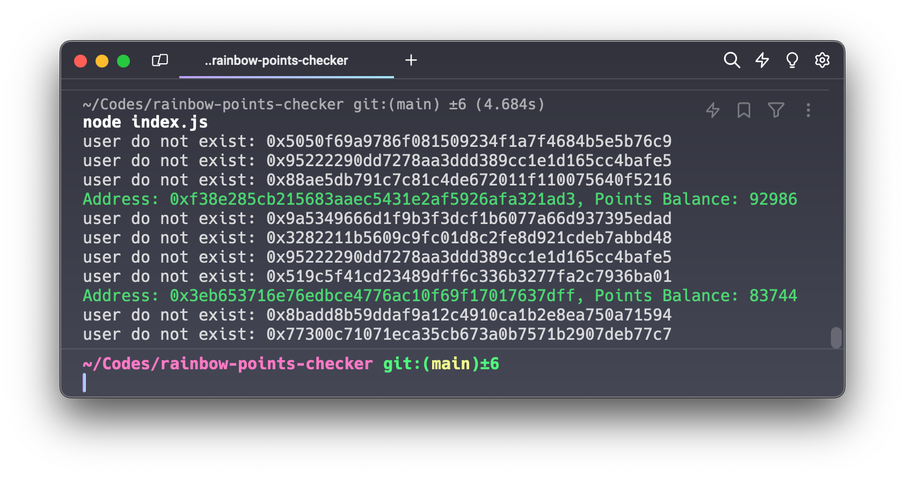

# Rainbow Wallet Balance Checker

This Node.js script checks the points balances of multiple Ethereum addresses using the Rainbow API in bulk. It reads addresses from a file, checks their balances concurrently with limited concurrency for efficiency, and logs the addresses with non-zero balances to an output file.




## Installation

Before running the script, ensure you have [Node.js](https://nodejs.org/en/download/) installed on your system. Then, install the required dependencies:

```bash
npm install # or yarn
```

## Usage

Place your Ethereum addresses in a file, with one address per line. By default, the script reads from `addresses.txt` in the project's root directory. 

To run the script, use:

```bash
node index.js
```

### Happy airdrop farming!

